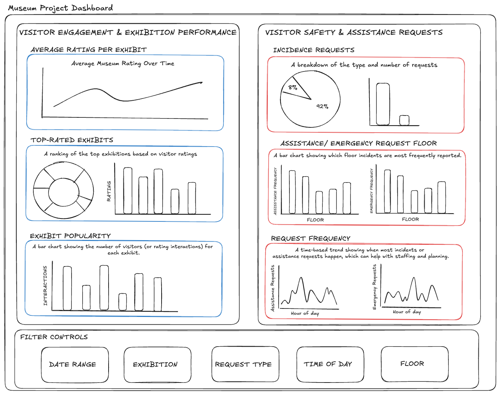
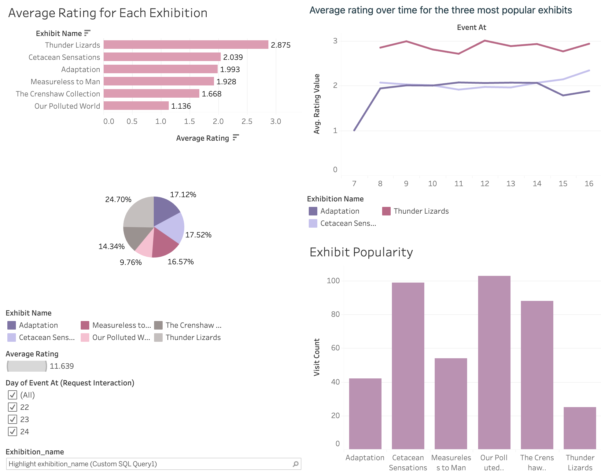
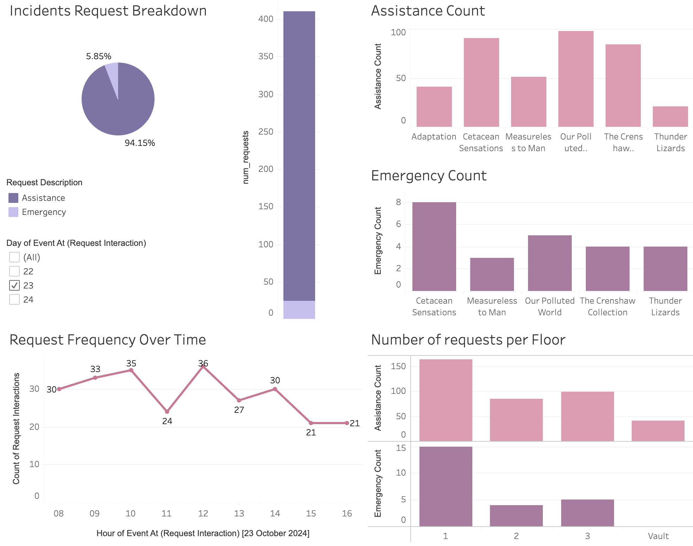

# Kafka ETL Pipeline

This repository contains all the code, documentation, and resources required for the **Kafka-based ETL Pipeline** and **Museum Dashboard Design**.

## Overview

This project handles the real-time processing of visitor interaction data, including visitor ratings and assistance requests at Liverpool Natural History Museum exhibitions, as well as providing stakeholders with a real-time dashboard for decision-making.

1. **Kafka ETL Pipeline**: A pipeline to handle real-time data processing of visitor feedback using Kafka, validating the data, and loading it into a PostgreSQL database.
2. **Museum Dashboard**: A Tableau-based dashboard designed for two key stakeholders, **Angela Millay (Exhibitions Manager)** and **Rita Pelkman (Head of Security & Visitor Safety)**, to help them monitor visitor engagement and safety

### Kafka Pipeline

The Kafka ETL pipeline processes live visitor interaction data from a Kafka topic, validates each message, and inserts the data into PostgreSQL tables for further analysis. The pipeline is designed to handle both visitor ratings and assistance/emergency requests.

### Features:
- **Kafka Consumer**: Extracts real-time data from a Kafka topic.
- **Data Validation**: Ensures data accuracy, including valid rating values, assistance requests, and timestamps.
- **Database Interaction**: Inserts validated data into the PostgreSQL database, keeping a record of visitor ratings and assistance requests.
- **Error Logging**: Logs invalid messages for review.
- **Configurable Limits**: Allows control over how many messages are processed, and provides flexibility in the pipeline configuration.

### Museum Dashboard Design

In addition to the ETL pipeline, this project includes a **Tableau dashboard** designed to provide live insights to two main stakeholders:

#### Angela Millay (Exhibitions Manager):
- Angela’s primary concern is **visitor engagement** and **exhibition performance**. She requires data on how visitors rate exhibitions and how popular they are based on visitor interactions.
- **Key Dashboard Features** for Angela:
  - **Average Rating Over Time**: A line chart showing how exhibitions are rated over time.
  - **Exhibit Popularity**: A bar chart indicating which exhibitions are receiving the most visitor interactions.
  - **Top-Rated Exhibits**: A list or table showing the highest-rated exhibitions, based on visitor feedback.

#### Rita Pelkman (Head of Security & Visitor Safety):
- Rita’s focus is **visitor safety**. She needs to understand where and when visitors request assistance or report emergencies within the museum.
- **Key Dashboard Features** for Rita:
  - **Incident Requests Breakdown**: A pie chart breaking down the proportion of assistance vs emergency requests.
  - **Request Frequency Over Time**: A time-based chart showing when most requests occur.
  - **Heatmap of Assistance/Emergency Requests**: A visual representation of where requests are most frequent in the museum.

---

## Wireframe Design

Before building the dashboards in Tableau, a **wireframe design** was created to outline the layout and key metrics for both Angela and Rita.

Here’s the wireframe design for the dashboard:



- It features visualisations such as a line chart for average visitor ratings over time, a bar chart for exhibit popularity, and pie and bar charts for incident requests, categorised by type and location. Filter controls allow users to customise their view by date, exhibition, request type, time of day, and floor, providing a tailored analysis for each stakeholder's needs.

---

## Tableau Dashboards

After designing the wireframe, the dashboards were built in **Tableau** to provide interactive, real-time insights for both stakeholders. Here’s how the final dashboards are structured:

### Angela’s Dashboard
1. **Average Visitor Rating Over Time**: A line chart that visualizes how visitor satisfaction evolves over time for different exhibitions.
2. **Exhibit Popularity**: A bar chart showing the most frequently visited exhibitions.
3. **Top-Rated Exhibits**: A bar and pie chart displaying the top rated exhibitions.



### Rita’s Dashboard
1. **Incident Requests Breakdown**: A pie chart that breaks down the number of assistance vs emergency requests.
2. **Request Frequency Over Time**: A line chart showing when the most assistance or emergency requests occur throughout the day.
3. **Location of Requests**: A bar chart displaying on what floor requests are most frequently made in the museum.
4. **Request Frequency per exhibition***: Bar charts showing the requests counts for each exhibition.



---

## Pipeline Workflow

1. **Kafka Stream Extraction**:
   - Consumes real-time visitor interaction data from a Kafka topic.
   
2. **Data Transformation**:
   - Validates that each interaction falls within valid business rules, such as valid rating values and assistance requests.
   - Ensures interactions occur within valid museum operating hours (8:45 AM - 6:15 PM).
   
3. **Database Insertion**:
   - Inserts valid records into PostgreSQL tables:
     - **`request_interaction`**: Records visitor requests (assistance/emergency).
     - **`rating_interaction`**: Records visitor feedback ratings for exhibitions.

## Functions

### kafka_pipeline.py

- **`configure_consumer(topic: str) -> Consumer`**:
    Configures and returns a Kafka consumer connected to a specific topic.
  
- **`configure_database() -> connection`**:
    Establishes and returns a connection to the PostgreSQL database using environment variables for credentials.
  
- **`get_cursor(connection: connection) -> cursor`**:
    Returns a database cursor for executing SQL queries.
  
- **`get_foreign_key(cursor, table: str, column: str, value: int, id_type: str) -> int`**:
    Retrieves a foreign key from the given table based on the provided column and value.
  
- **`insert_interaction(cursor, table: str, exhibition_id: int, interaction_id: int, event_at: str)`**:
    Inserts a record into either the `request_interaction` or `rating_interaction` table, depending on the interaction type.
  
- **`log_invalid_message(log_file: str, message: str, reason: str)`**:
    Logs invalid messages either to a log file or to the console, depending on configuration.
  
- **`validate_message(message: str) -> tuple[bool, str]`**:
    Validates the structure and content of incoming Kafka messages, ensuring that they meet business rules.
  
- **`process_messages(consumer: Consumer, connection, cursor, message_limit: int, log_file: str)`**:
    Consumes messages from the Kafka topic, validates each one, and inserts valid data into the appropriate PostgreSQL table.

---

## Database Tables
The schema.sql file handles the creation of all tables and relationships for this museum project.

- department: Stores department information.
    department_id: Primary key (auto-generated)
    department_name: Stored department names

- floor: Stores information about museum floors
    floor_id: Primary key (generated)
    floor_name: Floor name (required)

- exhibition: Stores information about museum exhibitions.
    exhibition_id: Primary key
    exhibition_name: Exhibition name
    exhibition_description: Description of the exhibition
    department_id: Foreign key, links to department
    floor_id: Foreign key, links to floor
    exhibition_start_date: Start date of the exhibition, must be between 1900 and today
    public_id: Unique public identifier for the exhibition

- request: Stores different types of visitor requests.
    request_id: Primary key (auto-generated)
    request_value: Request value, either 0 (assistance) or 1 (emergency)
    request_description: Description of the request

- rating: Stores visitor feedback ratings.
    rating_id: Primary key (auto-generated)
    rating_value: Rating value between 0 (terrible) and 4 (amazing)
    rating_description: Description of the rating

- request_interaction: Records interactions related to visitor assistance/emergency requests
    request_interaction_id: Primary key (generated)
    exhibition_id: Foreign key, links to exhibition
    request_id: Foreign key, links to request
    event_at: Timestamp of the interaction

- rating_interaction: Records interactions related to visitor feedback ratings
    rating_interaction_id: Primary key (generated)
    exhibition_id: Foreign key, links to exhibition
    rating_id: Foreign key, links to rating
    event_at: Timestamp of the interaction

Indices are used to improve query performance:

- Index on department_id and floor_id in the exhibition table.
- Index on exhibition_start_date in the exhibition table.
- Index on request_value and rating_value in the respective tables.

--- 

## Setup and Installation

### Prerequisites:
1. **Python 3.x** installed on your system.
2. **PostgreSQL** database instance.
3. **Kafka** for streaming visitor interaction data.
4. **Pip** for installing Python dependencies.

### Installation:

1. **Clone the repository**
2. **Navigate to the Kafka pipeline directory**:
    cd kafka_pipeline.py

3. **Set up a .env.prod file with the following environment variables:**
    BOOTSTRAP_SERVERS=your-kafka-bootstrap-servers
    SASL_MECHANISM=your-sasl-mechanism
    SASL_USERNAME=your-sasl-username
    SASL_PASSWORD=your-sasl-password

    DB_HOST=your-db-host
    DB_NAME=your-db-name
    DB_USERNAME=your-db-username
    DB_PASSWORD=your-db-password
    DB_PORT=your-db-port

4. **Run the following setup script** to automatically set up the environment and execute the pipeline:

    ```bash
    bash set_up.sh
    ```

   This script will:
   
   - Set up and activate a virtual environment.
   - Install required dependencies from `requirements.txt`.
   - Create an RDS database and EC2 instance.
   - Set up and reset the database by running the schema.
   - Run the Kafka pipeline script with default arguments

*Optional command line arguments can be used if running script manually:*
     - `--topic`: The Kafka topic to subscribe to (default: `lmnh`)
    - `--limit`: Number of messages to process (default: `100000`)
    - `--logfile`: Log invalid messages to a file instead of the terminal (optional)


